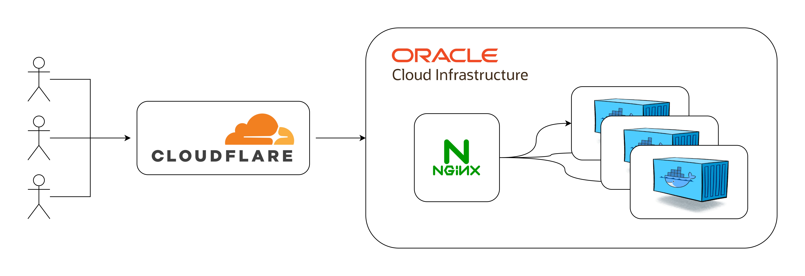

The gateway for all my personal projects. This runs inside docker and shares the same bridge network as all other services. Currently, all services run inside one Oracle always-free tier compute instance. Requests are proxied through CloudFlare.

Current list of domains this gateway serves:
1. Personal Site (https://erichuangt.com/)
2. Nepenthes Identifier Inference Gateway (https://tomscarnivores.com/resources/nepenthes-identifier/)
3. Integral3D (https://integral3d.erichuangt.com/)

